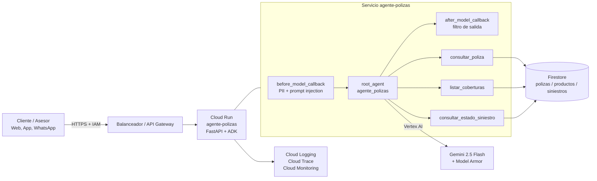

# Asistente de Consulta de Pólizas

Agente conversacional del **AI Lab de Seguros Bolívar** que atiende a clientes y asesores
que preguntan por:

- el **estado de una póliza** (vigencia, estado de pago, valor asegurado),
- las **coberturas y exclusiones** de su producto,
- el **estado de un siniestro** y el siguiente paso del proceso.

Está construido con [Google Agent Development Kit (ADK)](https://google.github.io/adk-docs/)
sobre **Gemini 2.5 Flash** en Vertex AI, consulta el core de pólizas a través de **Cloud
Firestore** y se despliega como servicio en **Cloud Run**.

## Arquitectura



| Componente | Ruta | Descripción |
|---|---|---|
| Agente raíz | `agente_polizas/agent.py` | `root_agent` de ADK con herramientas y callbacks |
| Instrucción | `agente_polizas/prompts.py` | Reglas de alcance, veracidad y privacidad |
| Configuración | `agente_polizas/config.py` | `pydantic-settings` a partir de variables de entorno |
| Herramientas | `agente_polizas/tools/` | Consultas con validación de formato y respuesta `status` |
| Repositorios | `agente_polizas/repositories/` | Interfaz + implementaciones Firestore y en memoria |
| Guardrails | `agente_polizas/guardrails/callbacks.py` | Enmascarado de PII, bloqueo de inyección, filtro de salida |
| API | `main.py` | `get_fast_api_app` de ADK + `/health` |

## Requisitos

- Python 3.11 o superior
- Credenciales de Google Cloud con acceso a Vertex AI (`gcloud auth application-default login`)
  para conversar con el modelo. Las pruebas unitarias no las requieren.

## Ejecución local

```bash
python -m venv .venv
source .venv/bin/activate        # Windows: .venv\Scripts\activate
pip install -e ".[dev]"
cp .env.example .env             # ajustar GOOGLE_CLOUD_PROJECT
```

Con `REPOSITORY_BACKEND=memory` el agente usa datos de ejemplo **ficticios**
(`POL-10000001`, `POL-10000002`, `POL-10000003`, `SIN-20000001`, `SIN-20000002`).

**Interfaz de desarrollo de ADK:**

```bash
adk web          # abrir http://localhost:8000 y seleccionar agente_polizas
```

**API HTTP (igual que en Cloud Run):**

```bash
uvicorn main:app --reload --port 8080

curl -X POST localhost:8080/apps/agente_polizas/users/u1/sessions/s1
curl -X POST localhost:8080/run -H "Content-Type: application/json" -d '{
  "app_name": "agente_polizas", "user_id": "u1", "session_id": "s1",
  "new_message": {"role": "user", "parts": [{"text": "Estado de la póliza POL-10000001"}]}
}'
```

## Pruebas y calidad

```bash
ruff check . && ruff format --check .
pytest
```

Las pruebas de `tests/` cubren herramientas, guardrails, repositorios y la API sin invocar
el modelo. La evaluación con el modelo real usa el set de ADK
[`tests/eval/polizas.evalset.json`](tests/eval/polizas.evalset.json):

```bash
RUN_LLM_EVAL=true pytest tests/eval
# o
adk eval agente_polizas tests/eval/polizas.evalset.json --config_file_path tests/eval/test_config.json
```

## Variables de entorno

| Variable | Valor por defecto | Descripción |
|---|---|---|
| `GOOGLE_CLOUD_PROJECT` | — | Proyecto de Google Cloud |
| `GOOGLE_CLOUD_LOCATION` | `us-central1` | Región de Vertex AI |
| `GOOGLE_GENAI_USE_VERTEXAI` | `TRUE` | Usar Vertex AI en lugar de Gemini API |
| `MODEL` | `gemini-2.5-flash` | Modelo del agente |
| `FIRESTORE_COLLECTION` | `polizas` | Colección base en Firestore |
| `REPOSITORY_BACKEND` | `memory` | `firestore` en ambientes desplegados |
| `LOG_LEVEL` | `INFO` | Nivel de logging |
| `ALLOWED_ORIGINS` | vacío | Orígenes CORS separados por coma |
| `SESSION_SERVICE_URI` | vacío | Servicio de sesiones persistente (opcional) |
| `TRACE_TO_CLOUD` | `false` | Exportar trazas a Cloud Trace |

## Despliegue

El pipeline [`cloudbuild.yaml`](cloudbuild.yaml) ejecuta lint y pruebas, construye la imagen,
la publica en Artifact Registry y despliega en Cloud Run (privado, ingreso interno + balanceador):

```bash
gcloud builds submit --config cloudbuild.yaml \
  --substitutions=_PROJECT_ID=<proyecto>,_REGION=us-central1,_TAG=v1.0.0
```

La cuenta de servicio de ejecución requiere `roles/aiplatform.user`, `roles/datastore.viewer`
y `roles/cloudtrace.agent`. El workflow [`.github/workflows/ci.yaml`](.github/workflows/ci.yaml)
ejecuta lint y pruebas en cada push y pull request.

## Versionamiento

Se sigue [SemVer](https://semver.org/lang/es/). Ver [CHANGELOG.md](CHANGELOG.md).
