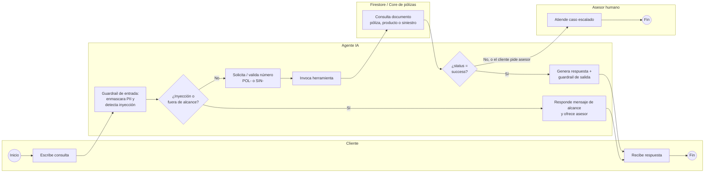

# 1. Entendimiento del negocio

## 1.1 Objetivo y problema de negocio

### Problema

La línea de Servicio al Cliente recibe en promedio **45.000 contactos informativos al mes**
sobre pólizas (estado y vigencia, coberturas de producto y estado de siniestros) a través del
call center y del WhatsApp de asesores. Son consultas repetitivas cuya respuesta ya existe en
el core de pólizas, pero hoy requieren que un asesor busque la información en varios
aplicativos, lo que genera tiempos de espera altos, atención limitada al horario laboral y
uso de capacidad de asesores en tareas de bajo valor.

### Objetivo

Disponer de un agente conversacional que responda de forma autónoma, segura y verificable las
consultas informativas de pólizas, coberturas y siniestros, 24/7, y que escale a un asesor
humano cuando la consulta lo requiera, liberando capacidad del call center para casos
complejos (reclamaciones, ventas, retención).

### Situación actual (punto de referencia, promedio ene–ago 2026)

| Indicador | Valor actual | Fuente |
|---|---|---|
| Contactos informativos de pólizas/siniestros por mes | 45.000 | Reporte de tipificación del contact center |
| Tiempo promedio de espera (ASA) | 4 min 10 s | Plataforma de contact center |
| Tiempo medio de atención (AHT) | 7,5 min | Plataforma de contact center |
| Resolución en primer contacto (FCR) | 68 % | Encuesta post-contacto |
| Satisfacción (CSAT, escala 1–5) | 3,9 | Encuesta post-contacto |
| Horario de atención | L–S 7:00–19:00 | Operación |
| Costo cargado por contacto atendido por asesor | COP 6.500 | Finanzas Servicio al Cliente (7,5 min × costo hora cargado de COP 52.000) |

### Métricas a mejorar

| Métrica | Línea base | Meta a 6 meses | Cómo se mide |
|---|---|---|---|
| Conversaciones atendidas por el agente / mes | 0 | 30.000 | Logs del agente (sesiones ADK) |
| Tasa de contención (resueltas sin asesor) | N/A | ≥ 60 % | Conversaciones sin escalamiento / total |
| Reducción de contactos informativos al call center | 0 % | ≥ 35 % | Tipificación del contact center |
| Tiempo de primera respuesta | 4 min 10 s | P90 ≤ 4 s | Cloud Monitoring (latencia `/run`) |
| CSAT del canal | 3,9 | ≥ 4,2 | Encuesta al final de la conversación |
| Disponibilidad del canal | 72 h/semana | 24/7, SLO 99,5 % | Uptime check sobre `/health` |

### Matriz RACI

R = Responsable (ejecuta), A = Aprobador (rinde cuentas), C = Consultado, I = Informado.

| Actividad | Desarrollador (Ingeniero de IA) | Líder del desarrollo (Líder AI Lab) | Responsable de negocio (Gerente Experiencia del Cliente) |
|---|---|---|---|
| Construcción de fuentes (réplica del core en Firestore, catálogo de coberturas, FAQ) | R | A | C |
| Desarrollo del modelo (agente, prompts, herramientas, guardrails) | R | A | C |
| Evaluación del modelo (evalset ADK, comparación de modelos, sesgo) | R | A | C |
| Pruebas funcionales (UAT con asesores) | C | I | R/A |
| Pruebas de carga y seguridad | R | A | I |
| Despliegue a producción | R | A | I |
| Monitoreo y operación (KPIs, alertas, costos) | R | A | I |
| Seguimiento de beneficios de negocio | I | C | R/A |

## 1.2 Caso de negocio

Supuestos: TRM COP 4.000/USD; precios de lista de Google Cloud (us-central1) a octubre de
2026; volumen objetivo de **30.000 conversaciones/mes**, con promedio de **4 turnos** por
conversación (120.000 turnos/mes).

### Costos

#### a) Consumo de tokens de Gemini 2.5 Flash (Vertex AI)

Por conversación se observaron en el piloto 6 llamadas al modelo (4 turnos, 2 de ellos con
llamada a herramienta) con el siguiente consumo promedio:

| Concepto | Tokens por conversación | Precio (USD / 1M tokens) | Costo por conversación (USD) |
|---|---|---|---|
| Entrada (instrucción + declaración de herramientas + historial + resultados de herramientas) | 15.000 | 0,30 | 0,004500 |
| Salida (incluye tokens de razonamiento, presupuesto limitado) | 1.100 | 2,50 | 0,002750 |
| **Total** | 16.100 | — | **0,007250** |

Costo mensual de tokens = 30.000 conversaciones × USD 0,00725 = **USD 217,50/mes**.

#### b) Infraestructura y operación mensual

| Rubro | Cálculo | USD/mes | COP/mes |
|---|---|---|---|
| Gemini 2.5 Flash (tokens) | ver tabla anterior | 217,50 | 870.000 |
| Cloud Run | 1 instancia mínima (1 vCPU, 1 GiB) ≈ USD 52 + 120.000 solicitudes de ~2,5 s ≈ USD 18 + balanceador ≈ USD 15 | 85,00 | 340.000 |
| Firestore | ~90.000 lecturas/mes (≈ 3 por conversación) + < 1 GiB almacenado | 3,00 | 12.000 |
| Cloud Logging, Monitoring y Trace | ~25 GiB de logs y trazas | 30,00 | 120.000 |
| Model Armor | 45 M tokens analizados − 2 M gratuitos = 43 M × USD 0,10/M | 4,30 | 17.200 |
| **Subtotal infraestructura** | | **339,80** | **1.359.200** |
| Mantenimiento evolutivo | 24 h/mes × COP 110.000/h (Ingeniero de IA) | — | 2.640.000 |
| **Total operación mensual** | | | **≈ 4.000.000** |

#### c) Inversión inicial (horas persona)

| Rol | Horas | Tarifa cargada (COP/h) | Costo (COP) |
|---|---|---|---|
| Ingeniero de IA (desarrollo, evaluación, despliegue) | 320 | 110.000 | 35.200.000 |
| Líder del desarrollo (arquitectura, revisión) | 60 | 150.000 | 9.000.000 |
| Experiencia del Cliente (definición, UAT) | 40 | 120.000 | 4.800.000 |
| Seguridad de la información y QA | 40 | 100.000 | 4.000.000 |
| **Total inversión** | **460** | | **53.000.000** |

### Beneficios cuantificados

| Concepto | Cálculo | Valor |
|---|---|---|
| Contactos evitados al call center (régimen) | 30.000 conversaciones × 60 % de contención | 18.000 contactos/mes (40 % de los 45.000 actuales) |
| Ahorro bruto por capacidad liberada | 18.000 × COP 6.500 | COP 117.000.000/mes |
| Ahorro realizable (conservador) | Se asume que solo 35 % se convierte en ahorro efectivo (menor contratación de temporada y horas extra); el 65 % restante se reasigna a gestiones de mayor valor y no se cuenta | **COP 40.950.000/mes** |
| Rampa de adopción | Mes 1: 30 %, mes 2: 50 %, mes 3: 75 %, mes 4 en adelante: 100 % | — |
| **Beneficio año 1** | 40,95 M × (0,30 + 0,50 + 0,75) + 40,95 M × 9 | **COP 432.000.000** |

Beneficios no cuantificados: atención 24/7, reducción del tiempo de espera, trazabilidad
completa de las consultas y mejora esperada de CSAT.

### Retorno de la inversión y periodo de recuperación

| Concepto | Año 1 (COP) | Año 2 (COP) |
|---|---|---|
| Beneficio | 432.000.000 | 491.400.000 |
| Inversión inicial | 53.000.000 | 0 |
| Operación (12 × 4,0 M) | 48.000.000 | 48.000.000 |
| **Costo total** | **101.000.000** | **48.000.000** |
| **Beneficio neto** | **331.000.000** | **443.400.000** |
| **ROI** = beneficio neto / costo total | **327,7 %** | **923,8 %** |

**Periodo de recuperación:** beneficio neto acumulado de COP 8,3 M (mes 1), 24,8 M (mes 2),
51,5 M (mes 3) y 88,4 M (mes 4). La inversión de COP 53,0 M se recupera a los
**≈ 3,0 meses** de la salida a producción.

**Sensibilidad:** si la contención fuera de 45 % (en lugar de 60 %), el beneficio año 1 sería
COP 324 M y el ROI 221 %; si el consumo de tokens se duplicara, el costo año 1 subiría a
COP 111,4 M y el ROI sería 288 %. El caso se mantiene positivo en ambos escenarios.

### Evidencia

- Pitch de la iniciativa: [anexos/pitch.md](anexos/pitch.md)
- Acta de aprobación del negocio: [anexos/acta-aprobacion.md](anexos/acta-aprobacion.md)

## 1.3 Integraciones y dependencias

| Sistema / servicio | Tipo | Dirección | Uso | Responsable |
|---|---|---|---|---|
| Vertex AI — Gemini 2.5 Flash | Servicio gestionado (LLM) | Saliente | Razonamiento y generación de respuestas | AI Lab |
| Model Armor | Servicio gestionado (seguridad) | Saliente | Filtro de prompts y respuestas (inyección, contenido dañino, datos sensibles) | Seguridad de la Información / AI Lab |
| Cloud Firestore (`polizas`, `polizas_productos`, `polizas_siniestros`) | Base de datos de lectura | Saliente | Consulta de pólizas, coberturas y siniestros | Datos / AI Lab |
| Core de pólizas y siniestros | Sistema fuente | Indirecta (réplica) | Origen de los datos replicados a Firestore cada 15 min por el proceso de sincronización | Tecnología Core Seguros |
| Canales web, app y WhatsApp de asesores | Consumidores | Entrante | Envían la conversación a la API `/run` vía balanceador con IAM | Canales Digitales |
| Plataforma de contact center | Destino de escalamiento | Saliente (fase 2) | Transferencia de la conversación a un asesor humano | Servicio al Cliente |
| Cloud Logging, Monitoring y Trace | Observabilidad | Saliente | Logs, métricas, alertas y trazas | AI Lab |
| Artifact Registry y Cloud Build | CI/CD | — | Construcción y despliegue | AI Lab |

**Dependencias críticas:** cuota de Vertex AI (RPM/TPM) en la región; disponibilidad del
proceso de sincronización core → Firestore (frescura máxima aceptada: 30 min); catálogo de
coberturas curado por Experiencia del Cliente a partir de los condicionados.

### Flujograma del proceso

Diagrama BPMN con carriles (Cliente, Agente IA, Firestore / Core de pólizas, Asesor humano):
[diagramas/flujo-proceso.drawio](diagramas/flujo-proceso.drawio) (abrir con
[diagrams.net](https://app.diagrams.net/)).

